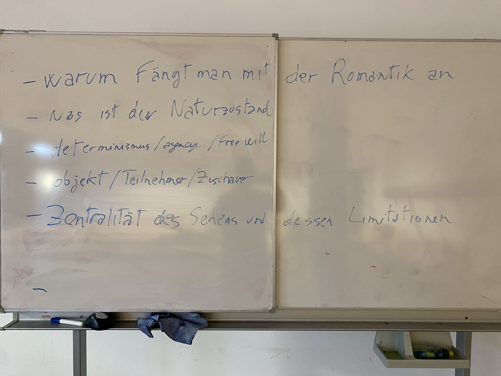

#### 2. Treffen

Need to pay greater attention to different ontologies. Maybe a dedicated meeting: Eduardo Viveiro (?) South America, something on Early Modern Europe and witches

How much can the parallel between evolution of ideas of social and natural environment tell us? What role was possibly played by the upheaval of social conditions that were up to a certain point perceived as "natural" (serfdom, slavery) in changing how we understand also the natural world. 

#### 3. Treffen

**Lektüren**

Güttler, Nils. “Gegenexpert*innen: Umwelt, Aktivismus und die regionalen Epistemologien des Widerstandes.” *NTM Zeitschrift für Geschichte der Wissenschaften, Technik und Medizin* 30, no. 4 (December 1, 2022): 541–67. https://doi.org/10.1007/s00048-022-00350-x.

Clapperton, Jonathan. “Indigenous Ecological Knowledge and the Politics of Postcolonial Writing.” *RCC Perspectives*, no. 4 (2016): 9–16.

Martin, Laura J. “Proving Grounds: Ecological Fieldwork in the Pacific and the Materialization of Ecosystems.” *Environmental History* 23, no. 3 (July 2018): 567–92. https://doi.org/10.1093/envhis/emy007.

**Fragen** 

- zu Güttler, wie können wir Öslers "institutionelle" Alternative und Ditfurths radikale Opposition vereinbaren; welches Format könnte produktiver sein
- was habe Querdenker bloss alles von der Umweltbewegung gelernt??? Wie konnte Counterculture langfristig so einen Einfluss haben und so rechtsradikalisiert werden?
- zu Clapperton, ist es möglich die Wissensansätze von verschiedenen Kulturen zu vereinbaren ohne dass es zu Machtgefälle kommt?
  - als Antwort wurde Gesagt dass die Machtgefälle unabdingbar sind, man muss sie aber wahrnehmen anstatt ignorieren
- on Martin: too US-centric. Ecosystem thinking existed before: why choose this specific example as a starting point? How can such a broad story be told only on the basis of one specific event?
  - the choice of the case studies greatly influences the path of the story told

Martin recaps on p. 2 the historiography of ecosystems as one moving from individuals to the political-social forces behind them, to focus on its materiality.

It is important to notice that Martin talks of "the making of ecosystems" but it is actually their conceptualization. The latter is a scientific layer, useful for understanding, but connections materially exist beyond the fact that human recognize or frame them: also the opposition Martin posits between the view of the 21st and the 17th c. seems not really to be the case. Both formulations could apply to the same thing.

Counterfactual: how would the history of ecosystems have evolved if it was "first" recognised in a different environment? how did the specificities of the nuclear case affect the later story?

Güttler: centrality of situatedness and scalarity in view of the writing of a "political knowledge history"

- how does this relate to nascent discussions about "political epistemologies"?

There is not only one "science" as there is not one "IK/TEK". The discourse needs to be kept open as to avoid the construction of unproductive dichotomies. There is also the risk of feeding nativism: only x can say y because they were born in the system z.... Be aware of essentialism (p. 13, Clapperton)

"what is needed is the recognition of a fluid, rather than largely static and all-encompassing, definition of indigenous environmental knowledge---one that views scientific knowledge created by indigenous peoples as being just as authentic, authoritative, culturally important. and "Indigenous" as other types of knowledge..." (Clapperton, 14)

**Further readings**

Güttler, Nils. “‘Hungry for Knowledge’: Towards a Meso-History of the Environmental Sciences.” *Berichte Zur Wissenschaftsgeschichte* 42, no. 2–3 (2019): 235–58. https://doi.org/10.1002/bewi.201900013.

Hersey, Mark D., and Jeremy Vetter. “Shared Ground: Between Environmental History and the History of Science.” *History of Science* 57, no. 4 (December 1, 2019): 403–40. https://doi.org/10.1177/0073275319851013.

Vom Notizblock

**2. Treffen -- Was ist Umwelt?**

**Fragen/Impulse**

- warum fängt man die Begriffsgeschichte von Umwelt mit der Romantik an?

- was ist der Naturzustand?

- Determinismus / agency / free will

- Wie kann man in der Wahrnehmung der Umwelt zwischen Objekt / Teilnehmer / Zuschauer differenzieren?

- Zentralität des Sehens und dessen Limitationen

Future thoughts: Need to pay greater attention to different ontologies. Maybe a dedicated meeting: Eduardo Viveiro (?) South America, something on Early Modern Europe and witches.

WH: How much can the parallel between evolution of ideas of social and natural environment tell us? What role was possibly played by the upheaval of social conditions that were up to a certain point perceived as “natural” (serfdom, slavery) in changing how we understand also the natural world. 

**3. Treffen -- Kennen**

**Fragen/Impulse**

- zu Güttler, wie können wir Öslers “institutionelle” Alternative und Ditfurths radikale Opposition vereinbaren; welches Format könnte produktiver sein

- was habe Querdenker bloss alles von der Umweltbewegung gelernt??? Wie konnte Counterculture langfristig so einen Einfluss haben und so rechtsradikalisiert werden?

- zu Clapperton, ist es möglich die Wissensansätze von verschiedenen Kulturen zu vereinbaren ohne dass es zu Machtgefälle kommt?

- als Antwort wurde Gesagt dass die Machtgefälle unabdingbar sind, man muss sie aber wahrnehmen anstatt ignorieren

- on Martin: too US-centric. Ecosystem thinking existed before: why choose this specific example as a starting point? How can such a broad story be told only on the basis of one specific event?

- the choice of the case studies greatly influences the path of the story told

Martin recaps on p. 2 the historiography of ecosystems as one moving from individuals to the political-social forces behind them, to focus on its materiality.

It is important to notice that Martin talks of “the making of ecosystems” but it is actually their conceptualization. The latter is a scientific layer, useful for understanding, but connections materially exist beyond the fact that human recognize or frame them: also the opposition Martin posits between the view of the 21st and the 17th c. seems not really to be the case. Both formulations could apply to the same thing.

Counterfactual: how would the history of ecosystems have evolved if it was “first” recognised in a different environment? how did the specificities of the nuclear case affect the later story?

Güttler: centrality of situatedness and scalarity in view of the writing of a “political knowledge history”

- how does this relate to nascent discussions about “political epistemologies”?

There is not only one “science” as there is not one “IK/TEK”. The discourse needs to be kept open as to avoid the construction of unproductive dichotomies. There is also the risk of feeding nativism: only x can say y because they were born in the system z…. Be aware of essentialism (p. 13, Clapperton)

“what is needed is the recognition of a fluid, rather than largely static and all-encompassing, definition of indigenous environmental knowledge—one that views scientific knowledge created by indigenous peoples as being just as authentic, authoritative, culturally important. and “Indigenous” as other types of knowledge…” (Clapperton, 14)

**Further readings**

Güttler, Nils. “‘Hungry for Knowledge’: Towards a Meso-History of the Environmental Sciences.” *Berichte Zur Wissenschaftsgeschichte* 42, no. 2–3 (2019): 235–58. https://doi.org/10.1002/bewi.201900013.

Hersey, Mark D., and Jeremy Vetter. “Shared Ground: Between Environmental History and the History of Science.” *History of Science* 57, no. 4 (December 1, 2019): 403–40. https://doi.org/10.1177/0073275319851013.

**4. Treffen -- Machen**

**Fragen/Impulse**

\- Inwiefern kann man Milieu als Teil eines Zeitgeists verstehen dass noch mehr Disziplinen als die die Pethes analysier involviert.

\- Was ist der Unterschied zwischen "environing technology"/"environing media"

Wir kamen zur Konklusion dass environing tech und environing media sich nicht klar und eindeutig unterscheiden lassen. Unsere gemeinsame Schlussfolgerung war eher dass environing media eine Teilerscheinung der environing technologies ist, dies wird aber nie klar von den Autoren gesagt. Man kann hier eine Forschungslücke entdecken: man könnte die Beziehung zwischen beiden Konzepten klarer theoretisieren und eindeutig sagen ob sie hierarchisch einzuordnen sind. Es gibt nämlich viele Aspekte der environing technologies die auch eher medial sind, wie das writing und das sensing. Die Frage zum spezifischen Mehrwert von Wickberg udn Gardebös theoretischer Ansatz bleib offen. Man kann aber von einer leichten Perspektivverschiebung sprechen, von den Technologien zu den Mediationsprozessen und Wissenspraktiken. Letztere könnten aber auch als Techniken im weiteren Sinne verstanden werden.

Zur Frage ob Milieu Teil eines Zeitgeists ist konnten wir, ohne eine weitere Analyse der Quellen und Literatur, leider nicht viel weiteres sagen. Tatsächlich wahrscheinlich ja, aber diese interessante Fragestellung würde die Debatte noch entfernter von der Umweltthematik führen als was Pethes selbst schon macht.

Meine Idee in der Auswahl dieser Text war die Geschichte von der Idee des Milieus zur theorisierung der environing media, klarer darzustellen. Eine Umwelt ist nie gegeben, ist sondern immer das Produkt eines System von Beziehungen und so eines sich ständig erneuerndes Prozess. 

Meine Idee bei der Auswahl dieser Texte war, die Geschichte der Idee das Umwelten vom Menschen (und nicht nur) mitgestaltet sind, von der Konzeptualisierung von Milieus bis hin zur Theoriesierung der environing media deutlicher darzulegen. Eine Umwelt ist demnach nie als gegeben zu betrachten, sondern immer das Produkt eines dynamischen Systems von Beziehungen -- ein sich ständig erneuernder Prozess (im Sinne des Seminarstitels).

**5. Treffen -- Erzählen**

In diesem Treffen haben wir eine andere Vorgehensweise benutzt. Anstatt mit Fragen zu den Lektüren anzufangen, haben wir kurz darüber gesprochen, wie man Umwelt(en) in Texten darstellen kann. Nach dieser kurzen Diskussion und der Lektüre eines Versuchs von mir, Geschichte persönlicher zu schreiben (https://www.environmentandsociety.org/sites/default/files/hardenberg_portal.pdf), habe ich die Teilnehmer*innen gebeten, 25 Minuten lang ihren eigenen Versuch im Nature Writing zu machen. Jeder hat dann seinen Text kurz präsentiert und wir haben gemeinsam besprochen, welche Eigenschaften man in unseren gemeinsamen Versuchen finden kann, die Nature Writing charakterisieren.

Diese Punkte haben wir hervorgehoben:

  \- Erinnerung

  \- Es muss nicht immer Natur sein

  \- Die Folgen von Krieg auf die Umwelt

  \- Gemeinschaft als umweltbildender Faktor

  \- Migration

Außer den Lektüren der Woche wurden die folgenden Texte als Beispiel von verschiedene Arten des "Naturschreiben" kurz vorgestellt:

\- Boyle, T. Coraghessan. *Blue Skies*. London Oxford New York: Bloomsbury Publishing, 2023.

\- Ghosh, Amitav. *The Great Derangement: Climate Change and the Unthinkable*. Chicago: University of Chicago Press, 2017.

\- Lanham, J. Drew. *The Home Place: Memoirs of a Colored Man’s Love Affair with Nature*. First paperback edition. Minneapolis, Minnesota: Milkweed Editions, 2017.

\- Lee, Jessica J. *Two Trees Make a Forest: In Search of My Family’s Past among Taiwan’s Mountains and Coasts*. New York: Catapult, 2020.

\- Macfarlane, Robert. *The Old Ways: A Journey on Foot*. London]: Penguin Books, 2013.

\- Magnason, Andri Snær. *On Time and Water*. London: Serpents Tail, 2020.

 

Die offene Frage ist, da Erinnerung bei allen so wichtig ist, wenn man über Umwelt schreibt, wie und ob man überhaupt über Umweltwandel schreiben kann. Das heißt, wie kann man effektiv darstellen, was gerade auf unterschiedlichen Größenordnungen (von Mikro bis Makro, von geologischer Zeit bis zur Zukunft) passiert? Eine Möglichkeit, die aus den Lektüren und den weiteren Texten, hervorgeht, ist die Vermischung von moderner Literatur mit poetischen und mythologischen Schreibformen, die uns erlauben könnten, die verschiedenen Dimensionen des Wandels greifbar zu machen.

**6. Treffen -- Klima**

Die Themen die wir im Kontext der Lektüren besprochen haben waren:

  \- Die rolle von Prophezeiungen, besonders im Sinne von self-defeating und self-fulfilling prophecies: wie beinflussen Climate Models unsere Entscheidungsprozesse und die Wahrnehmung des Wandels

  \- Anthropozentrismus: kann man es vermeiden in der Kultur den Menschen am Zentrum zu setzen?

  \- Freiheit: wie Frei ist die Menscheit im Kontext einse radikalen Wandels ihrer Lebenskonditionen

  \- Themenvereinfachung durch Literatur: ist das der Sinn der Literatur (Risiko von nicht sehr guter Propagandaliteratur)

 

Wie sinnvol ist es bei Klimawandel und Anthropozän von Mensch als Spezies zu sprechen? So ein Ansatz dehistorisiert die Krise, zu Gunsten einer Generalisierung der "Schuld". Es wird so auch schwieriger gerechte Lösungen sich zu überlegen.

Ein langer Teil der Sitzung wurde dazu gewidmet die Idee einer nich-anthropozentrischen Wahrnehmung der Welt und die Art und Weise in der man more-than-human in der Literatur und andere narrative Formate einfügen kann zu diskutieren. Es hängt davon ab was man mit Anthropozentrismus meint. Man sollte immer explizit machen dass der Mensch nicht am Zentrum des Universums liegt. Das ist nur die Folge von unseren Blickwinkel: wir fühlen uns am Zentrum weil wir alles um uns herum sehen. Es erscheint unvermeidbar dass die Weltwahrnehmung des Menschen von sich selbst beginnt. Andere Arten würden voraussichtlich dasselbe machen. Kultur und Geschichte sind halt strukturell anthropozentrisch, und dieses Aspekt sollte man akzeptieren wenn man versucht über das Anthropzentrismus zu gehen. Das Risiko ist sonst eine banale Anthropomorphisierung des Anderen. 

Ausserdem bleib die Frage offen, wie man sogenannte *slow disaster* (Knowles), inklusive den Klimawandel, effektiv aus eine menschlichen Perspektive narrativ darstellen kann. Wenn die erreignisse sich auf einer Zeitskale verteilen die zu gross ist für die Mittel des modernen Romans und Films, wie könne wir sie dann erzählen. Und könne wir sie erzählen ohne Menschen als Protagonisten und Antagonisten zu benützen?

**7. Treffen -- Schützen**

**Fragen/Impulse**

\- de-extinction --> Folgen/Möglichkeiten eine technische Transformation der Debatte über Artensterben

\- Parise Abkommen als Baseline für Schutz

\- Ökosysteme verschwinden --> wie funktioniert de-extinction in so einen Kontext

\- Entscheidung über was zu Schützen als Produkt von Machtverhältnisse

\- Wer trägt Verantwortung für Entscheidung

\- Wie Entscheidet man was wir Schützen

\- Artensterben ist nichts neues --> wie können wir vom Ende der Zukunft reden?

Auf der Basis der Lektüren haben wir über was überhaupt Schutz heisst gesprochen. Schutz an sich ist eine anthropozentrische Dimension die darauf fokussiert die Teile der Natur aus bestimmten Gruunden zu schützen. Diese können physiologisch oder ästhetisch sein, entstammen aber immer aus einer gesellschaftlichen Diskussion. Mit Honnefelder kann man sagen dass dass es entweder um den gegenwartige Zustand, die Überlebensbedingungen der Menschheit, eine verlorengegangene 'heile Natur' geht. Für welche man sich entscheidet, welche man schützt ist ein politischer Produkt, der nur als Teil einer innergesellschfatlichen Debatte Form nimmt.

Zum Thema der de-extinction haben wir darüber gesprochen in wieweit die Tierarten die aus der de-extinction entstehen, tatsächlich die Tierarten die man reporduzieren möchte sind. Ist ein mit Mammutgenen manipulierter Elefant ein Mammut? Wieviel Generationen sind nötig, in sicht von Casetta's Verständnis von artifiziell und natürlich als ein Kontinuum, um diese neue Tierart auf Mammut und Elefant basis wieder natürlich werden lassen? Und, muss man der Wissenschaft Grenzen setzen: die Idee zu verstehen ob sowas überhaupt möglich ist wurde mit Interesse betrachtet, auch wenn die Risiken eines solchen Vorangehens hervorgehoben wurden.

Machtverhältnisse bestimmen tatsuachlich maßgeblich:

- Was geschützt wird

- Wie geschützt wird

- Wer die Entscheidungsgewalt hat

Die Frage wie man erfolgreichen Naturschutz definiert blieb offen, weil dies auch Teil eines politischen Prozess ist. Honnefelder zeigt uns wie die Wissenschaft alleine darauf nicht antworten kann, da sie Teil eines Systems ist das keine Wert-Urteile erlaubt, sondern nur sagt wie sachen funktionierien. Es besteht also eine Wechselwirkung zwischen wissenschaftlichen Erkenntnissen und gesellschaftlichen Werten in der integrative Entscheidungsprozesse nötig werden.

**8. Treffen -- Spielen**

Das Ziel des Treffens war es zu verstehen, ob und wie man Umweltkrisen/-wandel als Spiel darstellen könnte. Auf Rat des gamelab.berlin haben wir beschlossen, eines der vorgeschlagenen Spiele auszuprobieren, anstatt ohne Erfahrung direkt zu versuchen, Spielideen zu entwickeln. Die Wahl fiel auf Hollows, da es anscheinend die dynamischste Struktur hat.

Der erste Punkt des Spielaufbaus ist die Kreation einer Umwelt. Dazu werden in den Anleitungen von Hollows verschiedene Punkte angegeben, die zu beachten sind. Wir haben nur manche davon wahrgenommen:

- Um was für ein Biom handelt es sich?

- Was für ein Ökosystem gibt es dort?

- Welcher menschliche Charakterzug hat den Kollaps herbeigeführt?

- Wie entfaltet sich der Kollaps?

- Was sind 3 Zeichen des Kollaps?

- Und was sind 4 "Landmarks" der Landschaft?

- Welche Schätze sagt man, dass es in der Umwelt gibt? Warum verlassen Menschen ihr Dorf, um in eine kollabierende Umwelt zu gehen?

Der Charakterzug, über den alle als Grund des Kollaps zugestimmt haben, ist Gier, und das Ökosystem um das Dorf ist ein Wald. Die erste Idee war eine Kolonialgeschichte, in der Externe die Umwelt ruiniert haben, weil sie etwas extrahieren woll(t)en. Hiervon ist man zur Idee einer Plantationsumwelt gelangt, die das Gleichgewicht verändert hat. Von der Plantation ist man aber schnell gemeinschaftlich zur Idee gekommen, dass es um (magische) Zuchttiere geht, die ursprünglich im Wald wohnten und schlechte Kräfte fernhielten. Deren Domestizierung hat zum Kollaps geführt, da kein Schutz mehr da war gegen Monster und Waldsterben. Außerdem führt die steigende Gier nach diesen Tieren, deren Blut den Menschen erlaubt, neue Ressourcen zu entdecken, auch zu gesellschaftlichen Problemen innerhalb des Dorfs. Außerdem führt der Konsum des Bluts auch zu Abhängigkeit, und dessen Kräfte werden weniger effektiv, je mehr man verbraucht. Menschen verlassen das Dorf durch eine Krisenlandschaft mit Monstern und immer weniger Ressourcen, um dank der magischen Kräfte des Bluts neue Orte zu finden, aus denen man Ressourcen abbauen kann.

Es wurde auch gesagt, dass es wichtig ist, die Vorgeschichte nicht als idyllisch darzustellen, sonst gäbe es keine Gründe für den Wandel. Die Idee der Idylle in der Vergangenheit ist ein soziales Konstrukt, das auf der Angst vor Umweltveränderungen basiert. In Wirklichkeit war der Wald ressourcenarm, und es war nötig, neue Ressourcen außerhalb zu finden. Das Blut gibt die Möglichkeit, dies effizienter zu haben. Die Idee einer Kolonialgeschichte, in der die Spieler die Besetzten sind, hat sich in eine Kolonialgeschichte verwandelt, in der die Spieler die Besetzer/Entdecker werden.

Nach einem kurzen Spielversuch in dieser Umwelt hat sich die Schwierigkeit gezeigt, ohne Vorbereitung als GM zu dienen. Das spannendste Teil ist der Umweltbau gewesen, in dem die meisten Seminarthemen natürlich eingeflossen sind. Es sieht tatsächlich so aus, als ob spielerischer Umweltbau es erlaubt, Umweltprobleme anders zu thematisieren. Wir haben uns dann gefragt, ob man auf der Basis der drei Spiele, deren Regeln gelesen wurden, ein neues Spiel zum "environing" entwickeln könnte. Ein paar Punkte zu möglichen Herangehensweisen kamen heraus:

- gemeinsamer Umweltbau

- Trennung in zwei Gruppen, die unterschiedliche Ontologien haben und deshalb die Umwelt anders wahrnehmen und deren magische Kräfte anders benutzen (ggf. gar nicht)

- Es ist ein narratives Spiel, das die Regeln des Theater-Improv benutzt: auf was in der Spielphase (nicht der Aufbauphase) von jemandem gesagt wird, kann man nur "ja, aber" oder "ja, und" antworten, nicht "nein, das ist nicht passiert". Was gesagt wird, passiert auch (hierzu kann man sich noch Stimmregeln ausdenken, falls gefühlt irgendetwas gegen die Umwelt geht, die man gebaut hat)

- Man könnte in Dog Eat Dog und Planetes nach Regeln für die narrative Interaktion schauen; die grobe Grundlage bleibt Hollows, die Spielphase findet aber ohne GM statt.

**Treffen 9 -- Ressourcen**

Die Diskussion konzentrierte sich auf das Thema des Extraktivismus. Die Fragen/Impulse waren:

  \- Spannung zwischen Entwicklung und Umweltschutz

  \- Grenzen der Gesetzgebung

  \- Grenzen des Systems

Von den Grenzen der Gesetzgebung, wie sie von Guttman geschildert werden - dass sich Gesetze auf Verfassungsebene in der Praxis selten so durchsetzen wie vorgesehen - kamen wir zu einer breiteren Diskussion darüber, ob eine Grenzziehung zu den Rechten der Natur in einem kapitalistischen System überhaupt Sinn macht. 

Außerdem wurde betont, dass es wichtig ist klarzustellen, dass die Rechte der Natur weiterhin menschliche Konstrukte sind und die Natur selbst nichts dazu sagen kann (hierzu siehe auch die Kritik an Latours Idee eines Parliament of Things).

Bei der Spannung zwischen Entwicklung und Unweltschutz wurde der fundamentale Konflikt zwischen wirtschaftlicher und ökologischer Perspektive hervorgehoben. Ressourcen sind für die Menschheit notwendig: Wie kann man sie beschaffen und dabei die Umweltschäden minimieren? Die Debatte über Extraktivismus und Naturrechte hat nicht nur eine rechtliche oder politische, sondern auch eine fundamentale philosophische und systemische Dimension, die weitergehender Diskussion bedarf.

**Treffen 10 -- Museumbesuch**

Interessante Angelegenheit in der uns Gezeigt wurde wie das Museum über Umweltdarstellung traditionell gedacht hat (Saurierhalle, Dioramen, einzel Exemplare) und wie es in den neuen Saalen Umdenkt (Taxa basierte Ausstellung von Tierschädel, die gliechzeitig wissenschaftliche Kategorien materiell darstellt und andere Umwelten, die der Wissensformen, hervorbringt)

**Treffen 11 -- Projektbesprechungen**

Konfidential 

**Treffen 12 -- Kapital (entfällt)**

**Treffen** **13** **-- Fühlen**

kurze Einführung in das Thema "Emotionsgeschichte" und wie sie mit "Sinnesgeschichte" zusammenhängt

- Kann man subjektive Erfahrung (von Umwelt z.B.) von emotionalem Erleben trennen?

- Bei unterschiedlichen Sinnen (z.B. wenn man den Sehsinn in einer Erfahrung wegnimmt oder einschränkt) kommen auch andere Gefühle zur Geltung

- Kritik an Flack/ Jörgensen: Sehr eurozentristischer Text, sowohl was die genannten Emotionen angeht, als auchdie Beispiele

- Gehen die Autor:innen von "reinen" Gefühlen aus? Was könnten solche sein? Angst vielleicht und andere "grundlegende" Emotionen. Die meisten Emotionen sind aber sehr komplex

- Gefühle wie "Liebe" sind überkomplex und schwer übertragbar auf andere Personengruppen

- Inwiefern sind Emotionen kulturell geformt? -> sehr stark, vgl. z.B.Patriotismus in Nordamerika und in Deutschland oder aber Freundschaft heute im Vergleich zu vor 200 Jahren

- Gibt es Beispiele ob Emotionen sich wandeln?

- Gibt es Beispiele für Emotionen, die genutzt wurden, um zu manipulieren? -> gerade heutzutage in den Medien sehr stark, aber auch im "shame"-Text von Hornaday

- Emotionen sind besonders effektiv zur Steuerung von Menschen

- Ist Emotionsgeschichte eine genderspezifische Geschichte? Ja!

- Schon Scham ist vermutlich genderspezifisch 

- Schuld: schlechte Tat, Scham: schlechte Person

- Assoziationen mit Hornaday-Zitaten: religiös? Der Mensch als Sünder und als grundsätzlich schlecht im Gegensatz zur "Natur", zu der auch die natives gehören

- Zusammenfassungen von Flack/ Jörgensen sind nicht ganz überzeugend -> Beispieltexte etwas kurz und zeigen nicht deutlich genug, wie Emotion und Gruppen oder Emotion und Aktion zusammenhängen

- Sehr neutrale aufklärerische Texte erscheinen beim Lesen paradox, sind irgendwie selbst emotional aufgeladen, weil sie ständig versuchen, Emotionen zu vermeiden

- Sinneseindrücke wie Geräusche haben sehr viel mit Emotionen zu tun, da ihre biologische Funktion ist, Erinnerungen zu kreieren und hervorzurufen

- Was würde einem im Alltag an Geräuschen Angst machen? Kommt auf den Kontext an, aber vermutlich nicht viele Geräusche "an sich"

- Unsere Erfahrung von Geräuschen sind heute starkvon Medien geprägt (z.B. Dschungel-Geräusche, von denen alle vermutlich einen gewissen Eindruck haben, auch wenn man nie im Dschungel war)

- Ist Lärm vielleicht auch in der Natur möglich? Natur-Geräusche werden trotzdem eher als "schön" wahrgenommen bzw. erinnert

- Ist ein Geräusch jemals per se schön oder unschön? Oder eher nicht?

- Empathisch über Tiere zu schreiben (zum Zweck des Naturschutzes) und Mitgefühl mit Tieren erwecken wollen ist schwierig, wenn man gleichzeitig nicht in die Anthropomorphologie-"Falle" geraten will -> wie könnte sowas besser gelingen? Vielleicht durch konkrete persönliche Erfahrung mit bestimmtenTieren (Bsp.: Vogel-Safari)

**Treffen 14 -- Kapital und Vorwärts**

**Impulse**

\- Warum heisst der Seminar überhaupt Umwelt als Prozess, wo es hauptsächlich von Interaktionen handelt?

  \- Prozesse könnten auch geschlossen sein, und nicht umbedingt aus Zusammenhänge bestehen

  \- Meine Antwort: ich habe mich für Prozess entschieden weil ich die historische Dimension des Umweltmachens hevorbringen wollte, und Prozesse halt historisch sind, während Interaktionen nicht unbedingt. Ausserdem beinhalten Prozesse Interaktionen, nicht alle Interaktionen aber Prozesse. Ich sehe aber ein dass man es auch anders sehen kann und verstehen könnte dass man Umwelt isoliert und sich wie ein chemisches Prozess von aussen anschaut. Ich muss weiter überlegen was zielführender ist. 

\- ist für eine planetarischen Governanche eine neue Denkensweise nötig?

\- Wie bauen wir Konsens zu den Lösungen der Umweltkrise?

\- Welche Rolle kann apokalyptische Denken dabei haben?

Das letzte und vor-vorletzte Termin wurden zusammengelegt, da die Anleitungen zu den Lektüren nicht 100% klar waren. Dies hat zu einer komplexeren Diskussion geführt zu der Rolle (und den Grenzen) von Kapitalismuskritik in der Bildung eines Konsens zur Notwendigkeit einer gemeinsamen, planetarischen Antwort zur Umweltkrise. Insbesonder, wurde hervorgehoben wie Kapitalismusakzeptanz der "existierende Konsens" ist, und vielleicht eine Arbeit in Richtung der Bildung einer neuen Form der planetarischen Governance die sich daran stützt produktiver sein könnte. Andererseits, basieren alle Lösung die auf den Kapitalismus basieren, auch die positiven Beispiele, auf der Ausbeutung der Ressourcen und der Idee dass Wachstum keine Grenzen haben kann und darf. 

Man könnte auch das Kapitalismus und dessen Transformation der Weit in der Moderne als die Apokalypse im biblischen Sinne verstehen: es hat eine neue Welt hervorgebracht (Fukuyama, End of History). Jetzt stehen wir aber vor den Grenzen dieser Apokalypse, die keine Rettung herbeiführt, sondern eher ein "life in ruins" (Tsing).

KI ratet hierzu

"Dies führt zu einer komplexeren Sicht auf planetarische Governance:

- Nicht nur die Frage nach Akzeptanz oder Kritik des Kapitalismus

- Sondern die Frage nach dem "Danach" - was folgt auf eine Apokalypse, die keine Erlösung bringt?

- Wie gestaltet man Governance in den "ruins"?

Diese Perspektive könnte helfen, über die Dichotomie von Kapitalismuskritik versus Kapitalismusakzeptanz hinauszudenken. Stattdessen könnte man fragen: Wie navigieren wir in einer Post-Apokalypse, die keine klare neue Ordnung hervorgebracht hat, sondern uns mit den Ruinen der alten konfrontiert?"

Der Punkt zu was Danach kommt und wie man es sich vorstellen kann wurde auch in der Diskussion hervorgebracht. Ich habe dazu gesagt dass kein Systemwechsel bisher historisch aus Willen und Konsens entstanden ist, sondern alle aus eine radikale Veränderung der grundlegenden Faktoren. Die Umweltkrise wird dies auch hervorbringen, Überlegungen dazu wie man es gestalten könnte haben das Potential eine positive Antwort auf den Wandel zu haben anstatt die radikalen sozialen Veränderungen nur zu akzeptieren. Bei der Umweltkrise geht es nicht so sehr um Natur und Umwelt, die wird es weiter geben, sondern um Menschen und Gesellschaft dessen weitere Entwicklung wir leiten wollen.

**Kernthemen und Entwicklungslinien des Seminars "Umwelt als Prozess" (KI-produziert)**

Das Seminar entwickelte sich über 14 Sitzungen als eigener Prozess der Wissensgenerierung und -vermittlung. Dabei wurden verschiedene methodische Zugänge erprobt:

**Konzeptuelle Grundlagen**

- Begriffsgeschichtliche Entwicklung von "Umwelt" seit der Romantik

- Verständnis von Umwelt als dynamisches Beziehungssystem

- Kritische Auseinandersetzung mit der Rolle verschiedener Wissensformen

**Innovative Methodik**

- Experimentelle Lehrformate wie Nature Writing und Spieleentwicklung

- Praktische Erprobung verschiedener Darstellungsformen

- Verbindung von theoretischer Reflexion und kreativer Praxis

**Kernthemen und deren Prozesscharakter**

1. Wissensformen im Wandel:

- Von wissenschaftlichen zu indigenen Perspektiven

- Von statischen zu dynamischen Umweltkonzepten

- Von der Trennung zur Integration verschiedener Wissensarten

1. Darstellungsweisen:

- Traditionelle bis zeitgenössische Museumskonzepte

- Literarische Verarbeitung von Umwelterfahrungen

- Spielerische Zugänge zur Umweltproblematik

1. Governance und Wandel:

- Von der Kapitalismuskritik zur Post-Apokalypse

- Von der Naturschutz-Debatte zur Gesellschaftstransformation

- Von reaktiven zu proaktiven Gestaltungsansätzen

**Methodische Innovationen**

- Integration emotionaler und sinnlicher Dimensionen

- Entwicklung spielerischer Zugänge zur Umweltthematik

- Verbindung persönlicher Erfahrung mit theoretischer Reflexion

**Zentrale Erkenntnis**Die Umweltkrise ist weniger eine Krise der Natur als eine gesellschaftliche Transformation, deren Gestaltung neue Denkweisen und Handlungsformen erfordert.

Diese prozessorientierte Zusammenfassung spiegelt die dynamische Entwicklung des Seminars wider und zeigt, wie verschiedene Perspektiven und Methoden zu einem vertieften Verständnis von Umwelt als gesellschaftlichem Prozess beitragen können.

