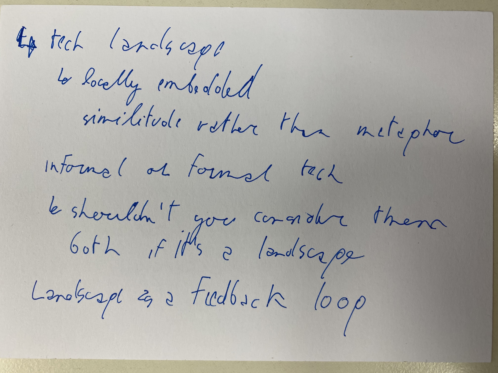
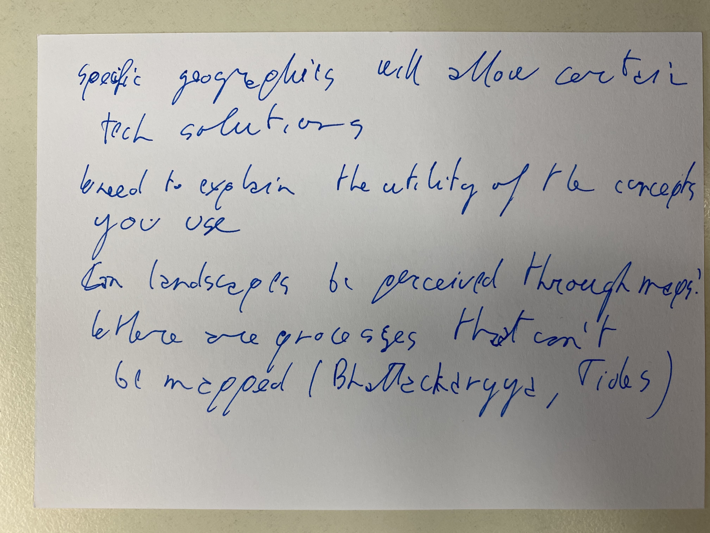

**OTHER COMMENTS, QUESTIONS, OR SUGGESTED LITERATURE** 

1. How might Joel Tarr's work on brownfields fit in?

2. In thinking about maintenace people might be interested in [https://themaintainers.org](https://themaintainers.org/)

3. Sarah Pritcheard's work on river systems in France and Germany

4. Ingold, T. (1993). The temporality of the landscape. *World archaeology*, *25*(2), 152-174.

5. Francesca Bray, Barbara Hahn, John Bosco Lourdusamy u. Tiago Saraiva, Cropscapes and History, in: *Transfers* 9 (1), 2019, https://doi.org/10.3167/TRANS.2019.090103. She engages with Ingold's taskscape in this article

6. Debjani Bhattacharyya, Almanac of a Tide Country, https://items.ssrc.org/ways-of-water/almanac-of-a-tide-country/ [Last accessed 06.01.2021]. 

7. You might want to look at Environmental Histories of World War on particularly Fitzgerald's essay. https://doi.org/10.1017/9781108554237

8. Wylie, J. (2007), Landscape, Routledge

9. On visualizing landscapes see Benjamine Cohen *Notes from the Ground*

10. For those interested Women in Environmental History is planning events for ASEH’s environmental history week https://www.envhistwomen.com/

11. Any one interested in joining the Food, Agriculture & Sustainability Special Interest Group during Environmental History please contact me gabriella.m.petrick@uis.no

