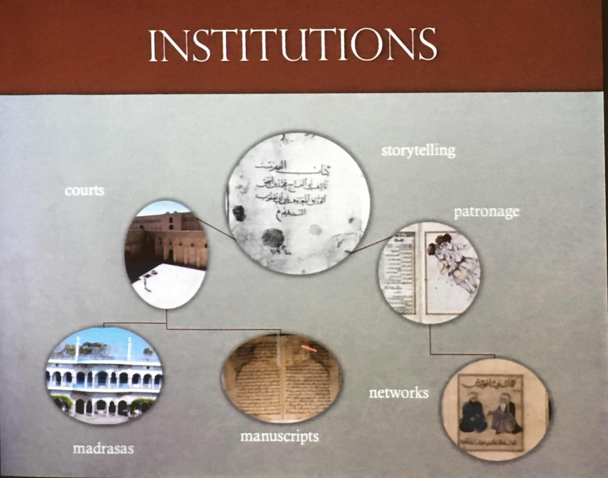

Storytelling as the most important institution in Islamicate societies
No clear boundaries of classical islamicate period, aprox until 12th century.  

\

Illustration is central in art, science, religion: descriptor for patronage.  

Storytelling, 5 kinds of narrative:  
    - origin narratives  
    - achievement narratives  
    - career narratives  
    - authority narratives  
    - wisdom narratives  

Scientists were storytellers themselves  

Post-classical period 13th to 17th century

Patronage has two forms  
    1. individual  
    2. loyalty between families  

Three elements in maintaining loyalty:  
    1. providing benefits  
    2. formal commitments (oaths, vows, safe conduct)  
    3. showing gratitude  

A vow = patron + Got = promise to do some good work on the basis of **good intentions** -> sciences, technology: irrigation channels, dams, bridges  

Support goes in both periods to people not to disciplines. Relationship is in both ways personal  

Dissimilarities in the two periods: madrasses changed rhetoric and function of patronage.
The madrasa is a cultural revolution in islamicate societies!!! -> teaching becomes a stable profession and moves outside of courts. Only condition to create a madrasa is to be a muslim (no gender, no class, no race distinctions)  

Power relationships however remain asymmetric and there are issues of corruption, violence, etc.  
